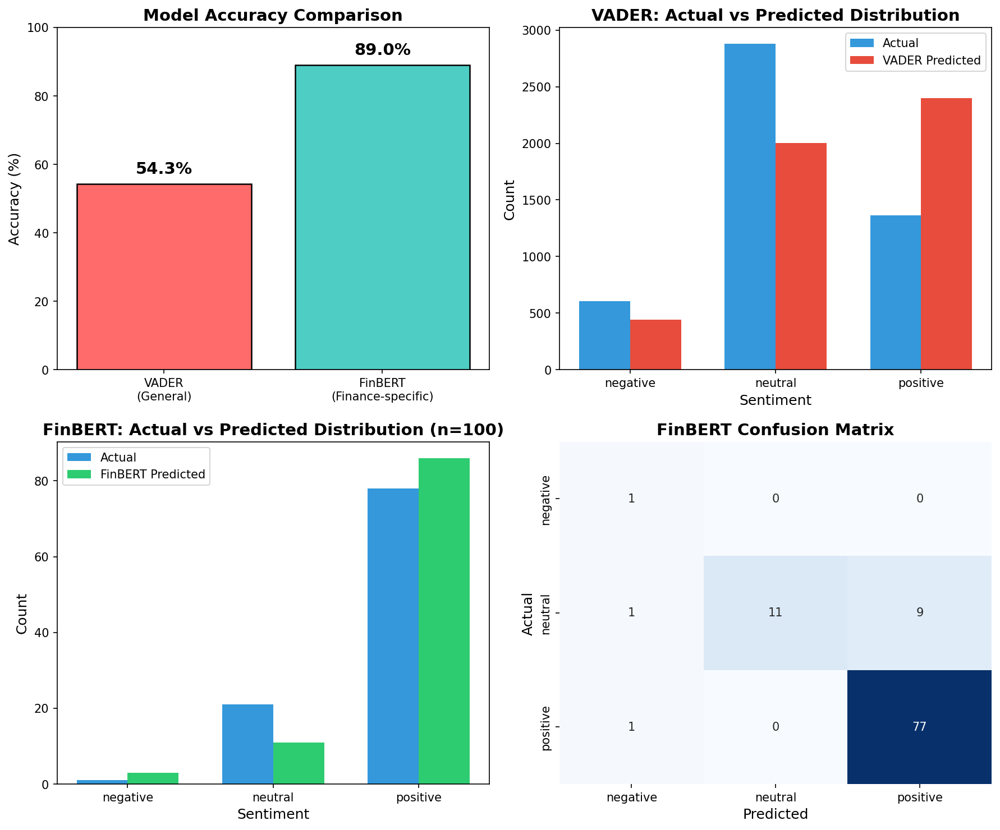

# Financial News Sentiment Analysis

A comparative study of sentiment analysis methods on financial news headlines, comparing traditional NLP (VADER) with domain-specific deep learning (FinBERT).

## Overview

This project analyzes the effectiveness of different sentiment analysis approaches on financial text data. Financial sentiment analysis is crucial for quantitative trading, risk management, and understanding market dynamics.

## Key Findings

| Model | Accuracy | Description |
|-------|----------|-------------|
| VADER | 54.33% | General-purpose, rule-based sentiment analyzer |
| FinBERT | **89.00%** | Pre-trained transformer fine-tuned on financial text |

**Key Insight**: Domain-specific models significantly outperform general-purpose tools for financial sentiment analysis, with FinBERT showing a **+35 percentage point improvement** over VADER.

## Dataset

- **Source**: [Financial PhraseBank](https://www.kaggle.com/datasets/ankurzing/sentiment-analysis-for-financial-news)
- **Size**: 4,846 sentences from English financial news
- **Labels**: Positive, Negative, Neutral
- **Annotators**: 16 experts with finance/business background

## Methods

### VADER (Valence Aware Dictionary and sEntiment Reasoner)
- Rule-based sentiment analysis tool
- Uses a sentiment lexicon with intensity measures
- Designed for social media text, not financial domain

### FinBERT
- BERT-based model fine-tuned on financial communication text
- Understands financial terminology and context
- Pre-trained on financial corpus including analyst reports, earnings calls

## Results



### Why FinBERT Outperforms VADER

1. **Domain Knowledge**: FinBERT understands that "restructuring" or "cost-cutting" may be positive for investors, while VADER may interpret these negatively
2. **Context Awareness**: Transformer architecture captures sentence-level context
3. **Financial Vocabulary**: Trained on financial-specific terminology

## Project Structure

```
financial-sentiment-analysis/
├── project.py           # Main analysis script
├── all-data.csv         # Dataset
├── results.png          # Visualization output
├── finbert_results.csv  # Detailed prediction results
├── README.md            # This file
└── requirements.txt     # Dependencies
```

## Installation

```bash
pip install pandas matplotlib seaborn scikit-learn vaderSentiment transformers torch
```

## Usage

```bash
python project.py
```

## Tech Stack

- Python 3.x
- pandas - Data manipulation
- matplotlib / seaborn - Visualization
- scikit-learn - Evaluation metrics
- vaderSentiment - Baseline sentiment analysis
- transformers (Hugging Face) - FinBERT model

## Future Work

- Test on larger sample size for FinBERT evaluation
- Add GPT-based sentiment analysis for LLM comparison
- Correlate sentiment scores with actual stock price movements
- Implement real-time financial news sentiment tracking

## References

- Malo, P., et al. (2014). "Good debt or bad debt: Detecting semantic orientations in economic texts." *Journal of the Association for Information Science and Technology*
- Araci, D. (2019). "FinBERT: Financial Sentiment Analysis with Pre-trained Language Models"
- Hutto, C.J. & Gilbert, E.E. (2014). "VADER: A Parsimonious Rule-based Model for Sentiment Analysis of Social Media Text"

## Author

Echo | UBC Computer Science

## License

MIT
